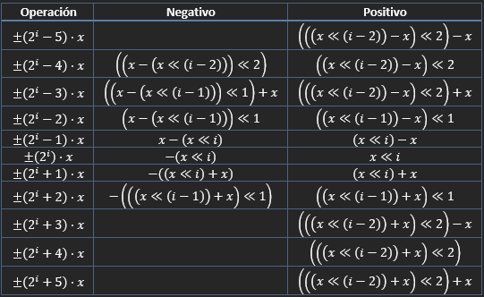

# A10: Traducción de instrucciones aritmético-lógicas

Los siguientes problemas se resuelven empleando las siguientes fórmulas; éstas evitan que el hardware de la multiplicación se emplee cuado se busca calcular el producto de una variable por una constante cuyo valor es próximo a una potencia de dos.

## Fórmulas

Las siguientes fórmulas se basan en la identidad $(2^i)(x) = x \ll i$, donde $x\in\Z$, $i \in \N$ y el operador $\ll$ corresponde al desplazamiento lógico hacia la izquierda, asumiendo que $x$ es un número binario.



## Problemas

1. Multiplicación de una variable por una constante próxima a 1024.
```C++
int a = 4, b = 1020*a;
```
2. Multiplicación de una variable por una constante próxima a -512.
```C++
int a = -4,  b = -510*a;
```
3. Multiplicación de una variable por una constante próxima a 64.
```C++
int a = 134, b = 69*a;
```
4. Multiplicación de una variable por una constante próxima a 4096.
```C++
int a = 0xFFFFF987, b = 4091*a;
```